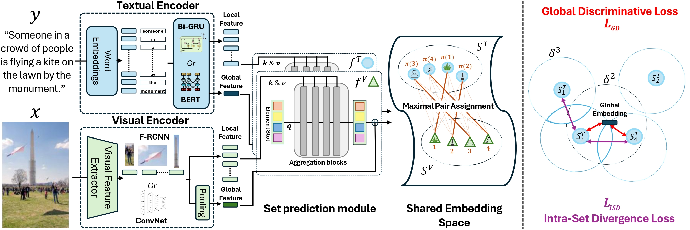

> Paper and Code will be released soon. Stay tuned!
---

<!-- Using HTML to center the abstract -->

    

        <h2>Abstract</h2>
        

Cross-modal image-text retrieval is challenging because of the diverse possible associations between content from different modalities. 
Traditional methods learn a single-vector embedding to represent semantics of each sample, but struggle to capture nuanced and diverse possible relationships cross-modally. Set-based approaches, which represent each sample with multiple embeddings, offer a promising alternative in that they can capture richer, more diverse relationships. 
In this paper, we show that, despite their promise, these set-based representations continue to face issues including sparse supervision and set collapse, which limits their effectiveness. 
To address these challenges, we propose a Maximal Pair Assignment Similarity function to optimize one-to-one matching between embedding sets which preserves semantic diversity within the set. We also introduce two loss functions to further enhance the representations: Global Discriminative Loss to enhance distinction among embeddings, and Intra-Set Divergence Loss to prevent collapse within each set. Our method achieves state-of-the-art performance on MS-COCO and Flickr30k without relying on external data.
        

    

<!-- After Abstract -->

    

        <figure>
            
<figcaption style="text-align: justify;">
    <em>
        Left: Overview of our SetDiv architecture with visual and textual encoders followed by set prediction modules to generate embedding sets \( S^V \) and \( S^T \). Right: Two key loss functions: Global Discriminative Loss, which pushes embeddings away from the global embedding to prevent set collapse, and Intra-Set Divergence Loss, which encourages diversity within each set.
    </em>
</figcaption>
        </figure>
    

---